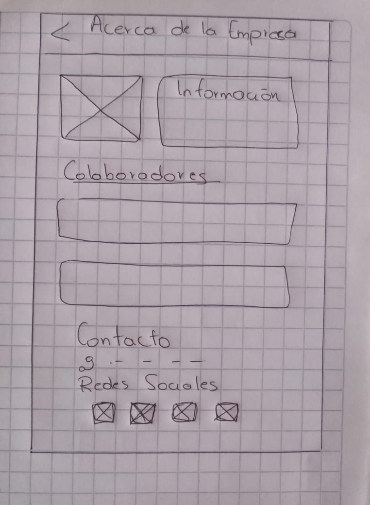
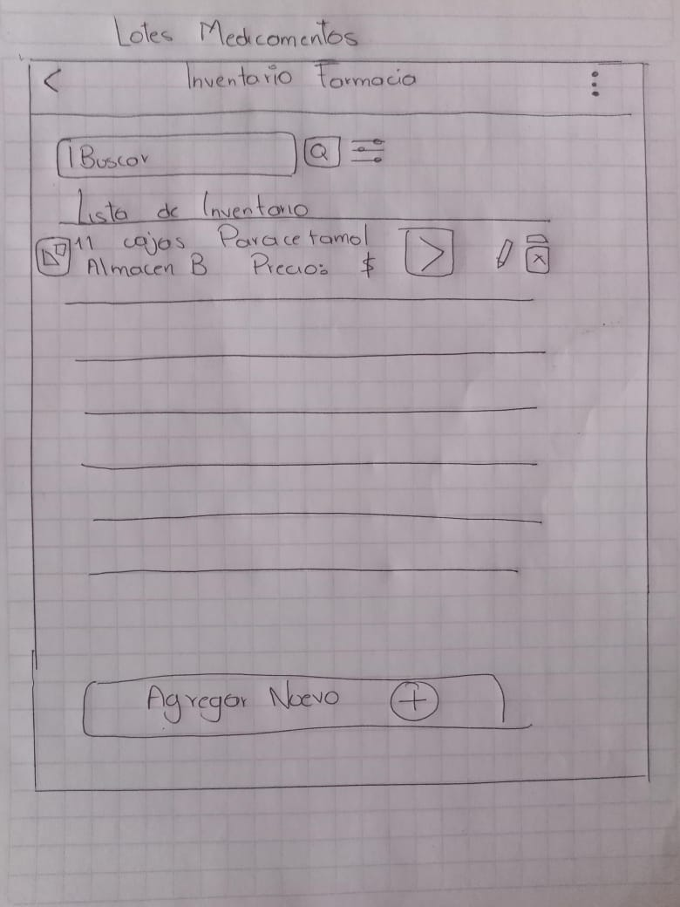
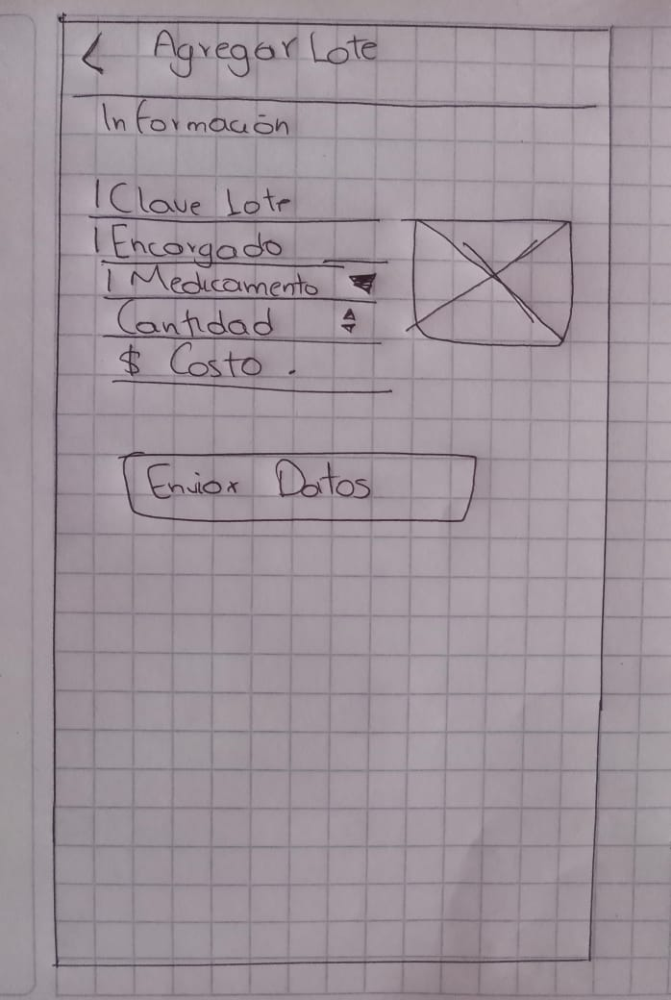
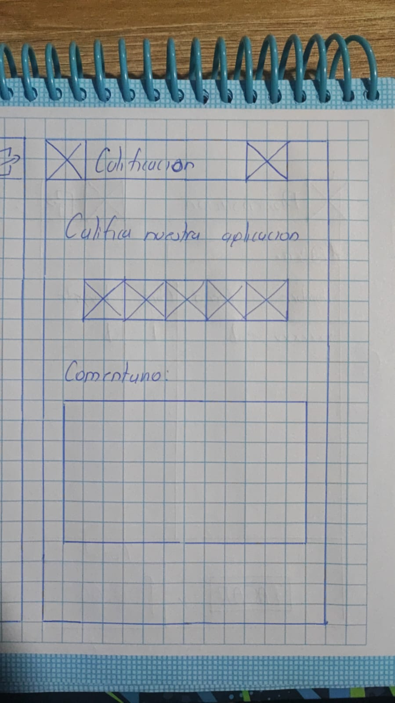
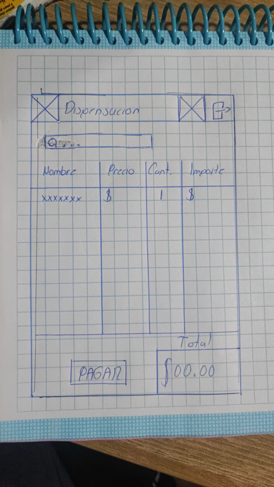
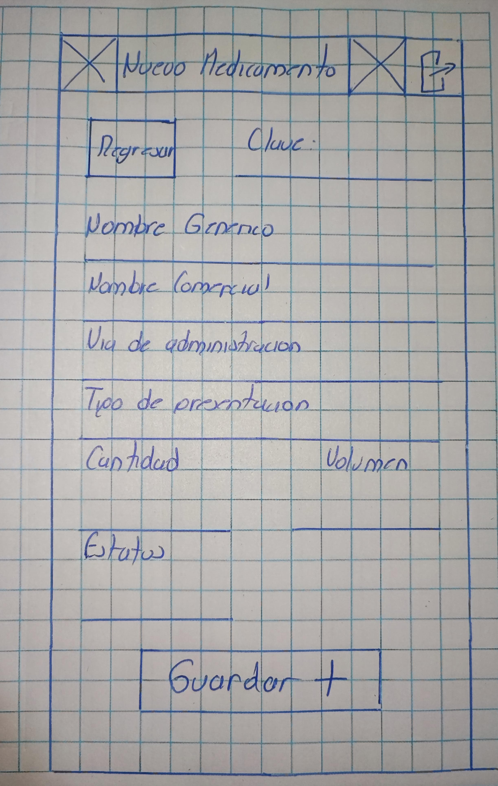
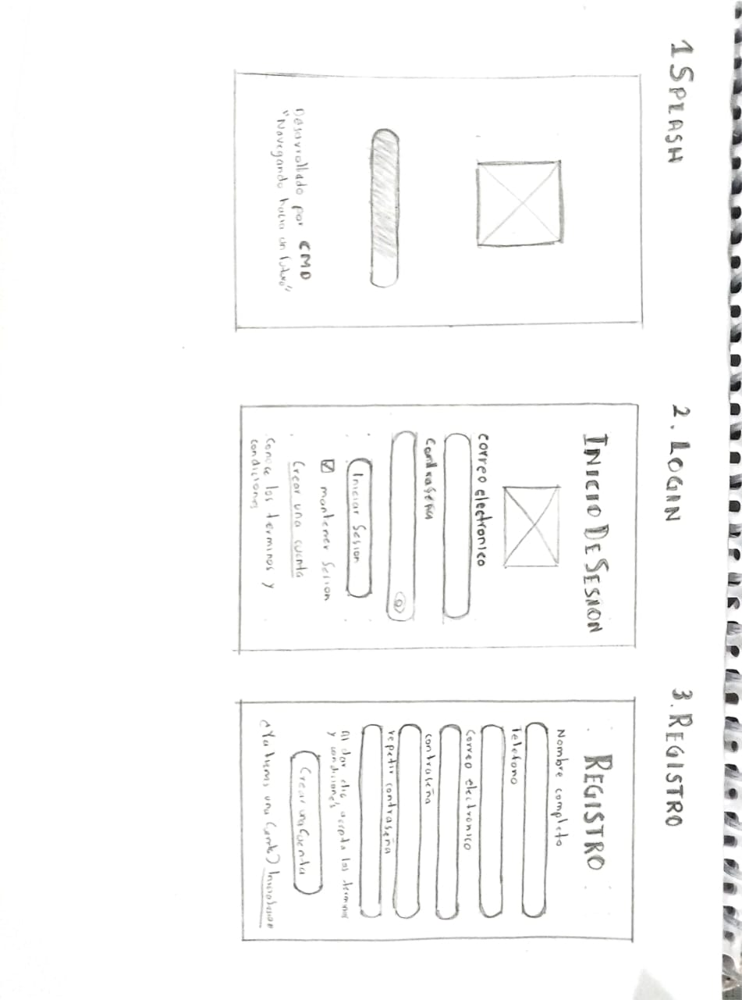
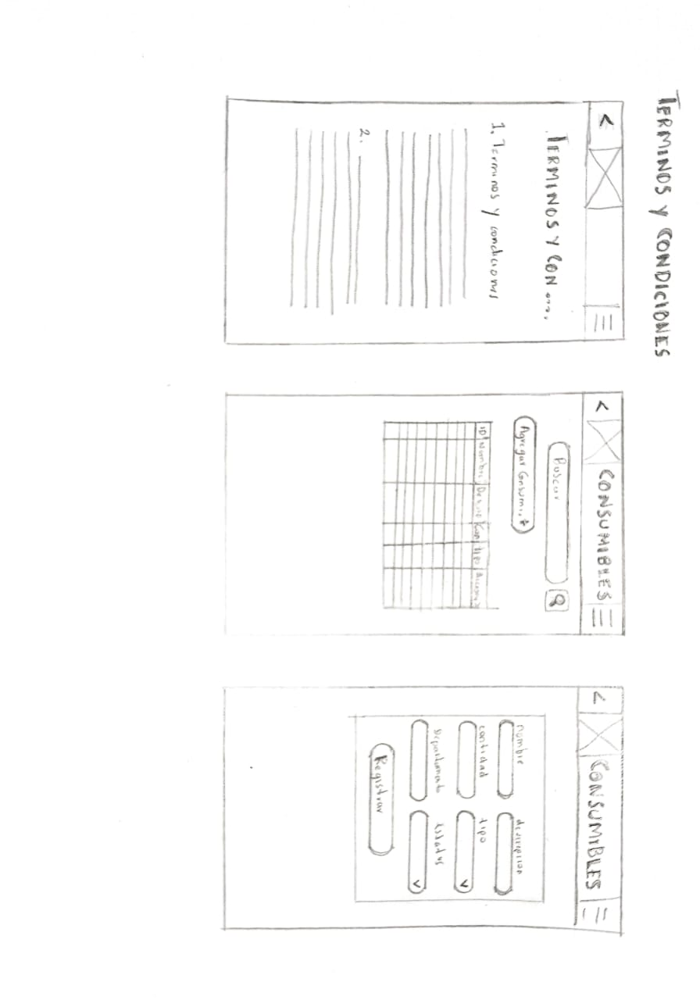
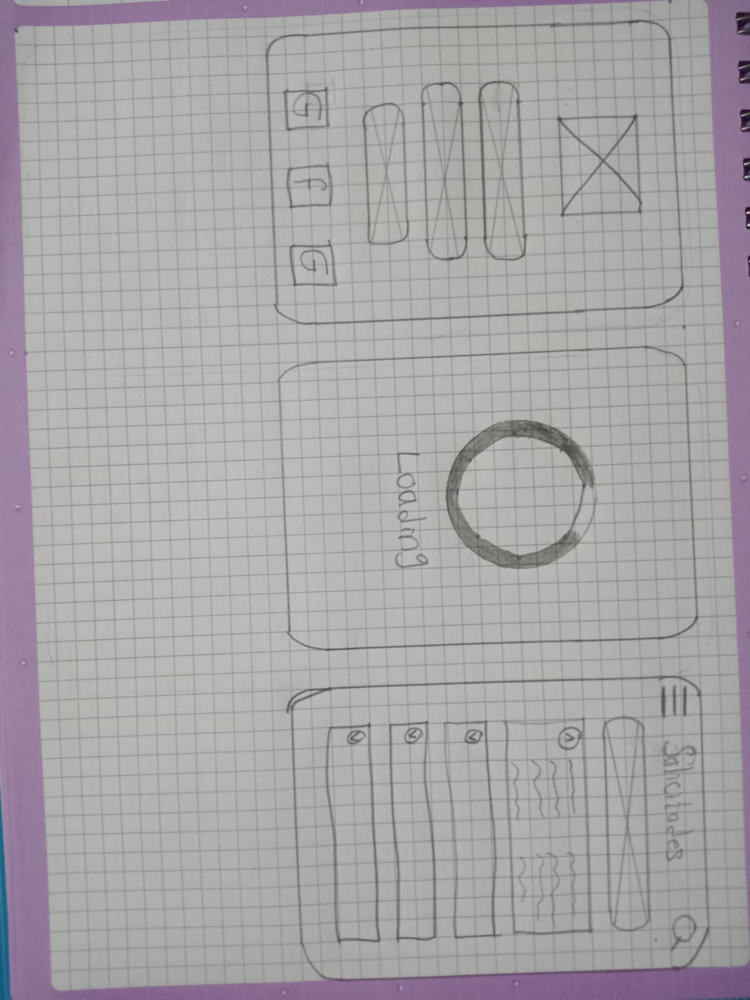

# Diseño En Figma Farmacia Intrahospitalaria

Link de Figma Modulo Farmacia https://www.figma.com/design/OBYpnqY6tCk7NGEkiwAfN6/Farmacia?node-id=0-1&t=u2AOHZlf6MhqdV7E-1

# 🏥 **Farmacia Intrahospitalaria**

Repositorio del módulo de **Farmacia Intrahospitalaria** para el **Hospital Privado Medical Care and Healing**

---

## 🌐 Organigrama CMD

---

## 🎯 **Objetivo Principal**

Implementar un sistema integral de gestión hospitalaria a través de un sitio web basado en **Vue.js**, con el fin de facilitar el trabajo de los médicos, mejorar la eficiencia operativa y fortalecer la administración y control del hospital.

En un entorno hospitalario dinámico y exigente, optimizar los procesos internos y mejorar la comunicación entre el personal médico y administrativo son esenciales. Con la creciente dependencia de la tecnología en el sector salud, aprovechar innovaciones tecnológicas será clave para alcanzar estos objetivos de manera efectiva y sostenible.

---

## 🎯 **Objetivos Específicos**

### 1️⃣ **Desarrollar una interfaz intuitiva**  
Diseñar y desarrollar una interfaz de usuario atractiva y fácil de usar que permita a los usuarios acceder de manera eficiente a las funciones del sistema.

### 2️⃣ **Integrar un sistema de gestión de base de datos (MySQL)**  
Diseñar la estructura de la base de datos para almacenar de manera segura y eficiente la información médica y operativa del hospital.

### 3️⃣ **Automatizar la gestión de citas médicas**  
Desarrollar un módulo que permita a los pacientes programar citas médicas de manera online, evitando conflictos de horarios y mejorando la eficiencia.

### 4️⃣ **Optimizar la gestión de expedientes médicos electrónicos**  
Implementar un sistema electrónico de registros médicos para facilitar el acceso rápido y seguro a los historiales clínicos.

### 5️⃣ **Facilitar la comunicación interna y externa**  
Integrar un sistema de mensajería interna para una comunicación rápida y segura entre el personal médico y administrativo.

### 6️⃣ **Implementar un sistema de gestión de recursos hospitalarios**  
Desarrollar un módulo para la asignación eficiente de recursos como camas, equipos médicos y personal.

### 7️⃣ **Capacitar al personal en el uso efectivo del sistema**  
Diseñar programas de capacitación para el personal médico y administrativo, asegurando un uso efectivo del sistema.

---

## 🏥 **Contexto de Negocio**

**Hospital Privado Medical Care and Healing** es una institución líder en el sector salud, comprometida con la mejora continua y la atención integral de los pacientes. Ofrece una amplia gama de servicios médicos, incluidos tratamientos especializados y cuidados intensivos, con el objetivo de proporcionar una atención de calidad y promover la salud preventiva.

Con un enfoque en la eficiencia operativa, el hospital busca mejorar la experiencia del paciente y optimizar sus procesos internos a través de un sistema de gestión integral.

---

## 💻 **Propuesta de Frontend**

### 🎨 **Sketches de diseño**

---

### 🎨 **Wireframes**

  
  

  
  

  
  

  
  

  
  

---
 
## ⚙️ **Requerimientos Funcionales**

| **RF**  | **Requisito**                 | **Descripción** |
|---------|-------------------------------|-----------------|
| RF1     | **Inicio de sesión**           | Permitir a los usuarios autorizados iniciar sesión. |
| RF2     | **Modificación de datos**      | Permitir modificar datos personales dentro del sistema. |
| RF3     | **Cierre de sesión**           | Permitir cerrar sesión de manera segura. |
| RF4     | **Recuperación de contraseña** | Proceso seguro para recuperar contraseñas olvidadas. |
| RF5     | **Interfaz intuitiva**         | Interfaz fácil de usar y navegar. |
| RF6     | **Catálogo de medicamentos**   | Mostrar un catálogo completo de medicamentos. |
| RF7     | **Búsqueda de medicamentos**   | Permitir búsqueda por nombre o categoría. |
| RF8     | **Detalles del medicamento**   | Mostrar información detallada de cada medicamento. |
| ...     | ...                           | ...             |

---

## 🔒 **Requerimientos No Funcionales**

| **RNF** | **Requisito**                 | **Descripción** |
|---------|-------------------------------|-----------------|
| RNF1    | **Seguridad de datos**         | Garantizar la protección de datos de pacientes y farmacia. |
| RNF2    | **Cumplimiento normativo**     | Asegurar que el sistema cumpla con regulaciones médicas y de privacidad. |
| RNF3    | **Tiempo de respuesta**        | Garantizar tiempos de respuesta rápidos. |
| RNF4    | **Escalabilidad**              | El sistema debe manejar aumentos repentinos en la carga de trabajo. |
| RNF5    | **Disponibilidad**             | El sistema debe estar disponible 24/7. |

---

## 📊 **Modelo Relacional**

---

## ⚖️ **Reglas de Negocio**

1. **Validación de prescripción médica**: Validar la prescripción médica antes de dispensar medicamentos.
2. **Registro de medicamentos en inventario**: Mantener un registro actualizado de todos los medicamentos.
3. **Alertas de stock bajo**: Notificar cuando el stock de un medicamento crítico esté por debajo del umbral.
4. **Manejo de medicamentos vencidos**: Identificar y marcar medicamentos vencidos para su eliminación.

---

### ✨ **Conclusión**

Este sistema busca mejorar la experiencia de los pacientes y optimizar la gestión interna del hospital. Con la implementación de las últimas tecnologías y estándares de seguridad, se espera mejorar la eficiencia operativa, facilitar la toma de decisiones y contribuir al bienestar de los pacientes.

---

> **"El mejor cuidado comienza con la tecnología más avanzada."**  
> **Hospital Medical Care and Healing por CMD**

