# Diseño En Figma Farmacia Intrahospitalaria

Link de Figma Modulo Farmacia https://www.figma.com/design/OBYpnqY6tCk7NGEkiwAfN6/Farmacia?node-id=0-1&t=u2AOHZlf6MhqdV7E-1

# 🏥 **Farmacia Intrahospitalaria**

Repositorio del módulo de **Farmacia Intrahospitalaria** para el **Hospital Privado Medical Care and Healing**

---

## 🌐 Organigrama CMD

---

## 🎯 **Objetivo Principal**

Crear una aplicación móvil que permita una gestión y administración del Hospital Privilage Care, a traves de herramientas de TICS, con el fin de facilitar el trabajo de los médicos, mejorar la eficiencia operativa y fortalecer la administración y control del hospital.

En un entorno hospitalario dinámico y exigente, optimizar los procesos internos y mejorar la comunicación entre el personal médico y administrativo son esenciales. Con la creciente dependencia de la tecnología en el sector salud, aprovechar innovaciones tecnológicas será clave para alcanzar estos objetivos de manera efectiva y sostenible.

---

## 🎯 **Objetivos Específicos**

### 1️⃣ **Recabar los requerimientos del modulo mediante técnicas de recolección (Encuestas)**  

### 2️⃣ **Diselar los Sketch (Propuesta de Frontend)**  

### 3️⃣ **Diseñar los Mockups**  

### 4️⃣ **Seleccionar las tecnologías**  

### 5️⃣ **Diseñar la base de datos (SQL)**  

### 6️⃣ **Desarrollar funcionalidades del modulo (Backend)**  

### 7️⃣ **Crear prototipo del modulo Farmacia**  

### 8️⃣ **Elaborar un manual de capacitación al personal hospitalario sobre el modulo Farmacia**

---

## 🏥 **Contexto de Negocio**

Hospital Privado Medical Care and Healing es una institución líder en el sector salud, comprometida con la mejora continua y la atención integral de los pacientes. Ofrece una amplia gama de servicios médicos, incluidos tratamientos especializados y cuidados intensivos, con el objetivo de proporcionar una atención de calidad y promover la salud preventiva.

Con un enfoque en la eficiencia operativa, el hospital busca mejorar la experiencia del paciente y optimizar sus procesos internos a través de un sistema de gestión integral.

---

## 🏥 **Metodología Scrum**

Scrum es una metodología ágil que se utiliza para gestionar proyectos de desarrollo de software, aunque también puede aplicarse en otros ámbitos. Es un marco de trabajo que permite a los equipos de trabajo gestionar de manera flexible y eficiente los proyectos complejos, entregando resultados de manera incremental y continua. Scrum fomenta la colaboración constante, la retroalimentación continua y la adaptación a los cambios.

### Roles en Scrum

•	Product Owner (Propietario del producto): Es la persona encargada de definir el producto y las prioridades del trabajo. Se asegura de que el equipo de desarrollo trabaje en las tareas que aporten mayor valor al negocio.

•	Scrum Master: Es el facilitador del proceso Scrum. Su función es eliminar obstáculos, ayudar al equipo a seguir los principios ágiles y garantizar que el proceso Scrum se implemente correctamente.

•	Equipo de Desarrollo: Son los profesionales encargados de ejecutar el trabajo necesario para cumplir los objetivos del proyecto. Están organizados en equipos autoorganizados y multidisciplinarios.
Artefactos de Scrum

•	Product Backlog: Es la lista priorizada de tareas o requisitos del producto. El Product Owner es el responsable de mantener y priorizar este backlog.

•	Sprint Backlog: Es la lista de tareas que se deben completar durante un sprint. Este backlog se obtiene del Product Backlog y se organiza en función de la capacidad del equipo y la prioridad del negocio.

•	Incremento: Es el conjunto de funcionalidades completadas durante un Sprint. Este incremento debe ser entregable y añadir valor al producto.

### Eventos de Scrum

•	Sprint: Es un ciclo de trabajo de duración fija, generalmente entre 1 y 4 semanas. En cada Sprint se trabaja para completar un conjunto de tareas del Sprint Backlog y entregar un incremento del producto.

•	Sprint Planning: Es la reunión en la que se planifica el trabajo a realizar durante el Sprint, determinando qué tareas del Product Backlog se moverán al Sprint Backlog.

•	Daily Scrum: Es una reunión diaria de corta duración (máximo 15 minutos) en la que el equipo de desarrollo comparte el progreso, los problemas encontrados y el plan para el día.

•	Sprint Review: Al final de cada Sprint, el equipo realiza una revisión del trabajo completado, mostrando el incremento al Product Owner y a los stakeholders.

•	Sprint Retrospective: Después de la Sprint Review, el equipo realiza una retrospectiva para discutir qué fue bien, qué se puede mejorar y cómo trabajar mejor en el próximo Sprint.

## 🏥 **Conexión Metodologica**

Scrum es útil porque permite a los equipos de trabajo adaptarse rápidamente a los cambios, mejorar continuamente sus procesos, colaborar de manera efectiva y entregar valor de forma constante. El uso de este marco metodológico ayuda a minimizar riesgos, aumentar la transparencia y optimizar la entrega de funcionalidades clave que aporten valor al negocio.

Scrum es el marco más popular de las metodologías Agiles. Es una metodología adaptativa (promueve la adaptación continua), iterativa (varias repeticiones), rápida, flexible y eficaz, diseñada para ofrecer al cliente/usuarios un valor significativo de forma rápida y a lo largo del proyecto.
Scrum asegura la transparencia en la comunicación y crea un ambiente de responsabilidad colectiva y el progreso continuo. El marco de Scrum, tal como se define en la Guía de SBOK, está estructurado de tal manera que apoya el desarrollo del producto y servicio en todo tipo de industrias y en cualquier tipo de proyecto, independientemente de su complejidad.

En el contexto del sistema hospitalario, esto permite:

•	Adaptación a cambios: Los cambios en los requerimientos, que son comunes en los entornos hospitalarios, pueden ser implementados rápidamente durante los sprints.

•	Entrega continua de valor: Cada sprint produce un incremento funcional del sistema que puede ser probado y evaluado por los usuarios.

•	Feedback constante: Los usuarios pueden retroalimentar el desarrollo del sistema de manera continua, asegurando que el producto final cumpla con las expectativas.

## 🏥 **Instruementos de Elaboración**

### Herramientas para Recabar Requerimientos:
Para recabar los requerimientos del proyecto, se utilizo Google Forms, creando encuestas para obtener información clave sobre las expectativas de los usuarios. Las encuestas contenían preguntas tanto cerradas como abiertas para capturar requerimientos funcionales y no funcionales.

### Preguntas de las Encuestas

### Preguntas si no cuenta con un sistema

#### 1: ¿Considera que enfrenta desafíos en la gestión de la farmacia intrahospitalaria?

•	a) Sí:

2. ¿Cuáles son los principales desafíos que enfrenta?

•	Falta de personal

•	Proceso ineficiente

•	Control de inventario deficiente

3. ¿Qué soluciones ha considerado para superar estos desafíos?

•	Capacitación del personal

•	Implementación de tecnología

•	Mejora de procesos

•	b) No:

2. ¿Qué aspectos de su gestión considera que funcionan bien?

•	Atención al paciente

•	Control de inventario

•	Eficiencia en procesos

3. ¿Qué medidas ha tomado para mantener esos aspectos positivos?

•	Capacitación continua

•	Revisión de procesos

4: ¿Utiliza procesos manuales para la dispensación de medicamentos a los pacientes?

•	a) Sí:

5. ¿Qué tipo de procesos manuales utiliza?

•	Listas de control

•	Formularios en papel

•	Registro en hojas de cálculo

6. ¿Qué dificultades ha encontrado con estos procesos manuales?

•	Errores de registro

•	Tiempo consumido

•	Falta de trazabilidad

•	b) No:

5. ¿Qué sistema utiliza para la dispensación?
•	Software de gestión farmacéutica

•	Sistema de gestión hospitalaria

•	Aplicaciones móviles

6. ¿Qué beneficios ha notado desde la implementación de este sistema?

•	Mayor eficiencia

•	Reducción de errores

•	Mejor seguimiento de medicamentos

7: ¿Controla el inventario de medicamentos de manera manual?

•	a) Sí:

8. ¿Cómo lleva el control de su inventario?

•	Hojas de cálculo

•	Listas impresas

•	Registros en papel

9. ¿Ha considerado cambiar a un sistema automatizado?

•	Sí

•	No

•	Tal vez en el futuro

•	b) No:

8. ¿Qué sistema utiliza para el control del inventario?

•	Sistema automatizado

•	Software especializado

•	Herramientas de gestión de recursos

9. ¿Qué características le resultan más útiles de este sistema?

•	Reportes en tiempo real

•	Alertas de caducidad

•	Integración con otros sistemas

10: ¿Tiene protocolos establecidos para gestionar la caducidad de medicamentos?

•	a) Sí:

11. ¿Cómo asegura que estos protocolos se sigan?

•	Capacitación del personal

•	Revisiones periódicas

•	Registro de cumplimiento

12. ¿Con qué frecuencia revisa estos protocolos?

•	Mensualmente

•	Trimestralmente

•	Anualmente

•	b) No:

11. ¿Le gustaría establecer protocolos para esto?

•	Sí

•	No

•	Tal vez

12. ¿Qué obstáculos enfrenta para establecer estos protocolos?

•	Falta de recursos

•	Resistencia del personal

•	Falta de tiempo

## Analisis
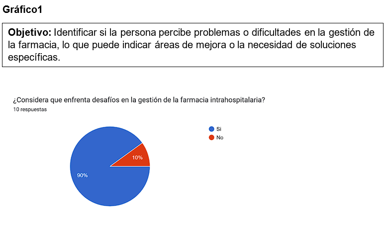
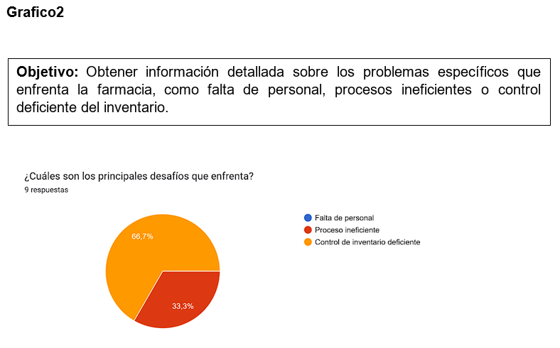
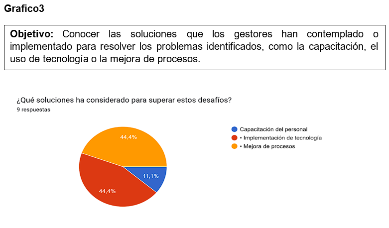

## 💻 **Propuesta de Frontend**

### 🎨 **Sketches de diseño**
A continuación, se muestra los sketches diseñados en base al sitio web anterior.

 
 
 
 
 
 
 
 
 
 
 
 
 
---

### 🎨 **Wireframes**

  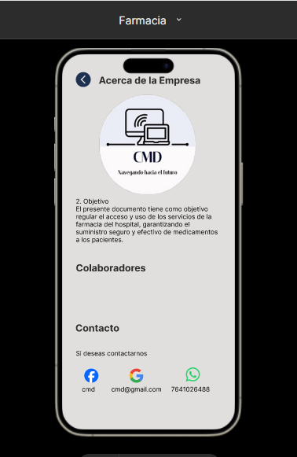
  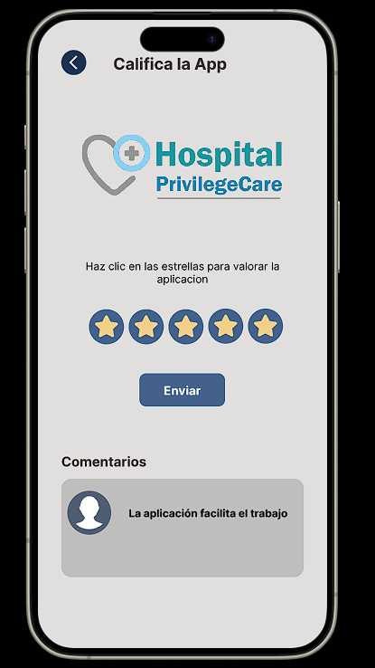

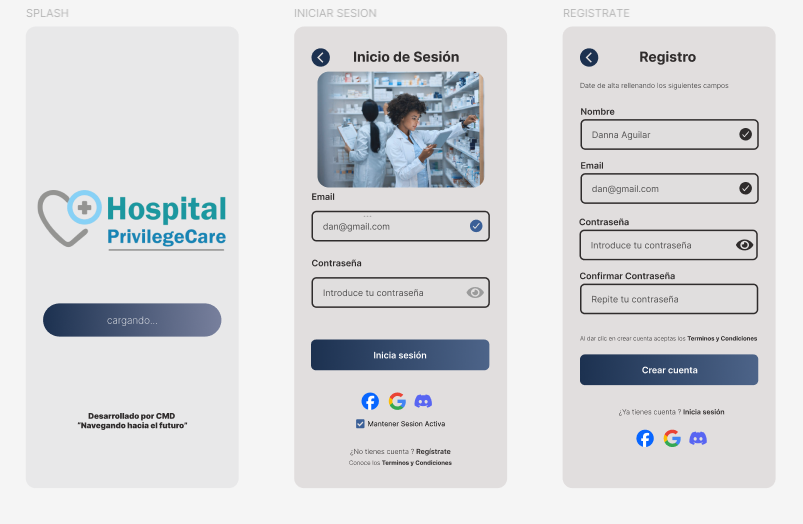
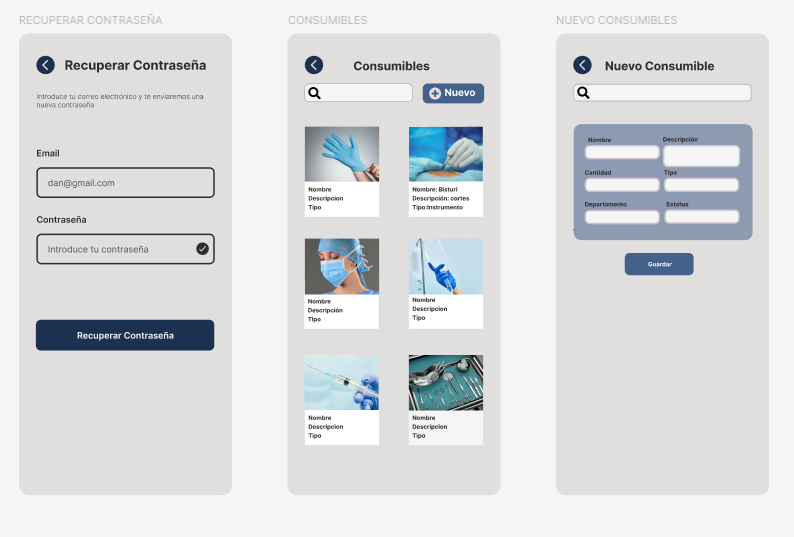
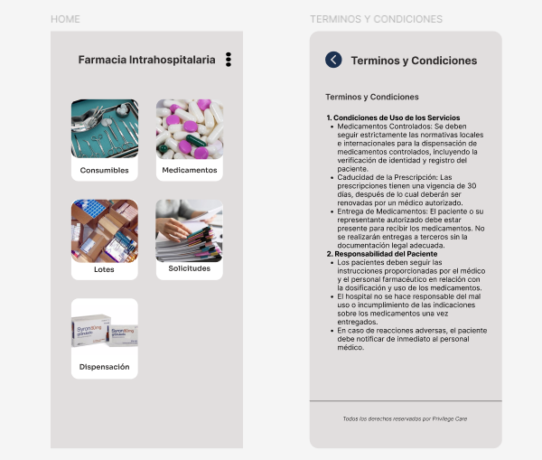

  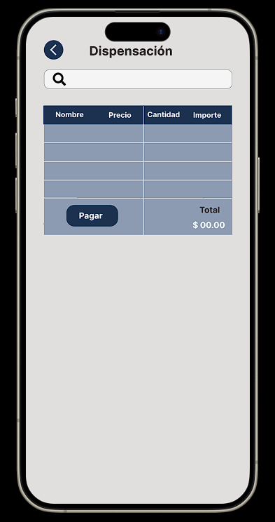
  

  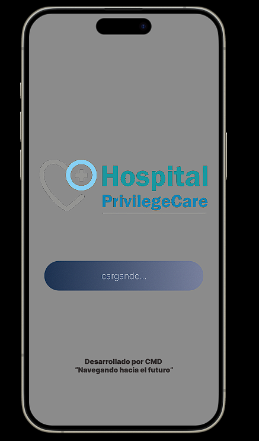
  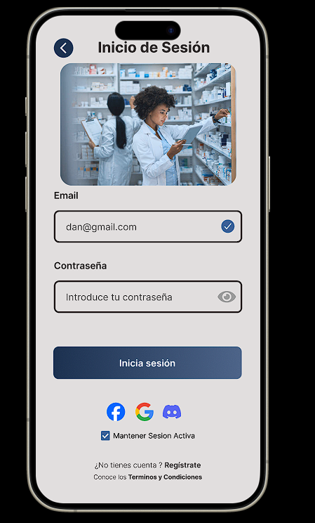

  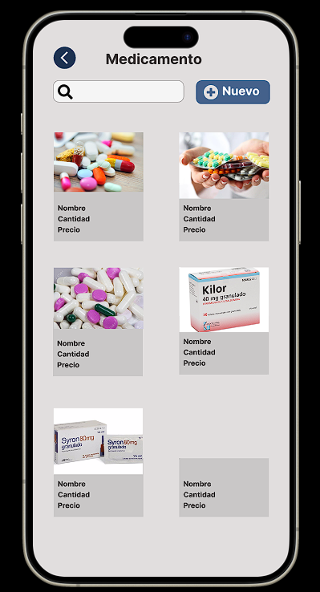
  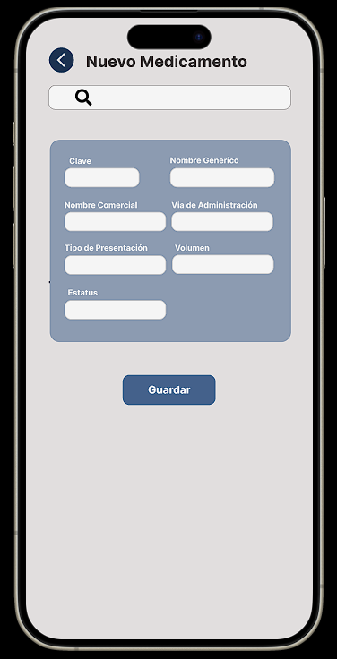

  
  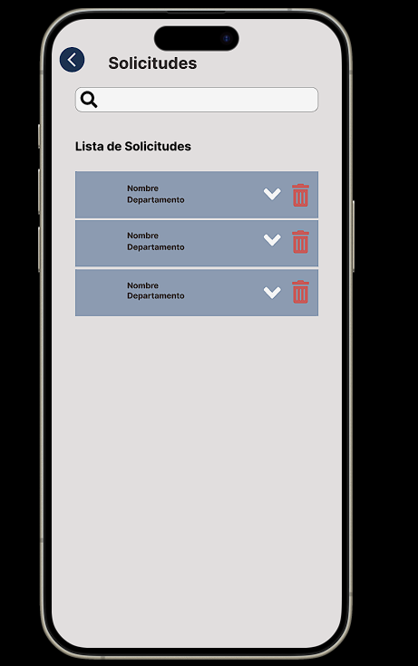

---
 
## ⚙️ **Requerimientos Funcionales**

| **RF**  | **Requisito**                 | **Descripción** |
|---------|-------------------------------|-----------------|
| RF1     | **Inicio de sesión**           | Permitir a los usuarios autorizados iniciar sesión. |
| RF2     | **Modificación de datos**      | Permitir modificar datos personales dentro del sistema. |
| RF3     | **Cierre de sesión**           | Permitir cerrar sesión de manera segura. |
| RF4     | **Recuperación de contraseña** | Proceso seguro para recuperar contraseñas olvidadas. |
| RF5     | **Interfaz intuitiva**         | Interfaz fácil de usar y navegar. |
| RF6     | **Catálogo de medicamentos**   | Mostrar un catálogo completo de medicamentos. |
| RF7     | **Búsqueda de medicamentos**   | Permitir búsqueda por nombre o categoría. |
| RF8     | **Detalles del medicamento**   | Mostrar información detallada de cada medicamento. |
| ...     | ...                           | ...             |

---

## 🔒 **Requerimientos No Funcionales**

| **RNF** | **Requisito**                 | **Descripción** |
|---------|-------------------------------|-----------------|
| RNF1    | **Seguridad de datos**         | Garantizar la protección de datos de pacientes y farmacia. |
| RNF2    | **Cumplimiento normativo**     | Asegurar que el sistema cumpla con regulaciones médicas y de privacidad. |
| RNF3    | **Tiempo de respuesta**        | Garantizar tiempos de respuesta rápidos. |
| RNF4    | **Escalabilidad**              | El sistema debe manejar aumentos repentinos en la carga de trabajo. |
| RNF5    | **Disponibilidad**             | El sistema debe estar disponible 24/7. |

---

## 📊 **Modelo Relacional**

---

## ⚖️ **Reglas de Negocio**

1. **Validación de prescripción médica**: Validar la prescripción médica antes de dispensar medicamentos.
2. **Registro de medicamentos en inventario**: Mantener un registro actualizado de todos los medicamentos.
3. **Alertas de stock bajo**: Notificar cuando el stock de un medicamento crítico esté por debajo del umbral.
4. **Manejo de medicamentos vencidos**: Identificar y marcar medicamentos vencidos para su eliminación.

---

### ✨ **Conclusión**

Este sistema busca mejorar la experiencia de los pacientes y optimizar la gestión interna del hospital. Con la implementación de las últimas tecnologías y estándares de seguridad, se espera mejorar la eficiencia operativa, facilitar la toma de decisiones y contribuir al bienestar de los pacientes.

---

> **"El mejor cuidado comienza con la tecnología más avanzada."**  
> **Hospital Medical Care and Healing por CMD**

